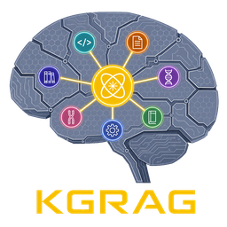

[](https://www.python.org/)
[](https://www.elastic.co/licensing/elastic-license)
[](https://github.com/Flux-Frontiers/KGRAG/releases)
[](https://github.com/Flux-Frontiers/KGRAG/actions/workflows/ci.yml)
[](https://python-poetry.org/)
[](https://zenodo.org/badge/latestdoi/PLACEHOLDER)

<p align="center">
  
</p>

**KGRAG** — Knowledge Compiler and Federated Retrieval Layer for Ontologically Grounded Domains

*Patent Pending — The Knowledge Compiler concept and its execution are the subject of a pending U.S. provisional patent application.*

*Author: Eric G. Suchanek, PhD · Flux-Frontiers, Liberty TWP, OH*

---

## Overview

KGRAG is a **federation and orchestration layer** for structural knowledge graphs derived from heterogeneous source domains. It integrates [PyCodeKG](https://github.com/Flux-Frontiers/pycode_kg) (Python codebase analysis), [DocKG](https://github.com/Flux-Frontiers/doc_kg) (semantic document indexing), [MetaboKG](https://github.com/Flux-Frontiers/metabo_kg) (metabolic pathways), [DiaryKG](https://github.com/Flux-Frontiers/diary_kg) (personal diary corpora), [AgentKG](https://github.com/Flux-Frontiers/agent_kg) (conversational memory), [FTreeKG](https://github.com/Flux-Frontiers/ftree_kg) (file system trees), and a growing family of domain-specific backends under a **single five-method adapter protocol**.

KGRAG treats **derived structure as ground truth** and uses **semantic embeddings strictly as an acceleration layer** for locating entry points into that structure. All graph traversal, ranking, and snippet extraction is deterministic. When KGRAG output is passed to a language model for synthesis, the model receives verified facts with full source provenance — not approximate embeddings.

---

## KG Types

### Fully Implemented

| Kind | Backend | Description |
|------|---------|-------------|
| `code` | PyCodeKG | Python codebase — AST-extracted modules, classes, functions, call graphs |
| `doc` | DocKG | Document corpus — Markdown/RST/text indexed by topic, section, and entity |
| `meta` | MetaboKG | Metabolic pathways — biochemical reaction networks (KEGG, BioCyc) |
| `diary` | DiaryKG | Personal diary entries — timestamped chunk graphs with temporal edges |
| `agent` | AgentKG | Conversational memory — Turn/Topic/Task/Summary graph (live session) |
| `filetree` | FTreeKG | File system tree — directory/file/module/dependency structure |
| `memory` | MemoryKG | Episodic memory — hybrid semantic + structural graph for conversation/event corpora |

### Stub Adapters (protocol boundary, backends under development)

| Kind | Backend | Description |
|------|---------|-------------|
| `gutenberg` | GutenbergKG | Project Gutenberg book corpus — literature indexed by author, genre, and chapter |
| `ia` | IABookKG | Internet Archive book corpus — public-domain books indexed by genre and topic |
| `pdbfile` | — | PDB structure files — 3D atomic coordinates and protein metadata |
| `disulfide` | — | Disulfide bond data — cysteine connectivity in protein structures |
| `verse` | — | Scripture/verse — Book → Chapter → Verse hierarchy and cross-references |
| `person` | — | Personal knowledge — biographical and relational graphs |
| `legal` | — | Legal corpus — statutory codes and regulations *(TBD)* |

### Corpus Abstractions

**Generic Corpus** — A named collection of any KG instances grouped for scoped federated queries. Useful for project-level or thematic groupings (e.g., `"KGRAG_repos"` combining code + doc KGs).

**Person Corpus** — A corpus enriched with personal metadata representing an individual. Aggregates all KGs relevant to a person — diaries, memories, documents, agent sessions, and more — alongside structured personal data (birth year, address, email, contact info).

---

## Features

- **Multi-domain federation** — Query code, docs, metabolic pathways, diary entries, and conversation history simultaneously
- **Five-method adapter protocol** — `is_available`, `query`, `pack`, `stats`, `analyze`; add a new domain by implementing five methods
- **Unified registry** — Persistent SQLite-backed storage of KG locations, metadata, corpora, and person records
- **Corpus abstraction** — Group KGs into named corpora for scoped federated queries
- **Person corpus** — Model individuals with personal metadata and their associated KG collections
- **Hybrid querying** — Semantic seeding via LanceDB + structural BFS traversal
- **Context packing** — Extract source-grounded snippets with line numbers for direct LLM ingestion
- **MCP server** — 22 tools exposing registry, corpus, and person operations to any MCP-compatible agent
- **CLI tooling** — Full CRUD for KGs, corpora, and person corpora; query, pack, analyze, synthesize
- **Streamlit dashboard** — Interactive browser for exploring and querying registered knowledge graphs
- **Deterministic retrieval** — Auditable, source-grounded results; zero hallucination at the knowledge layer

---

## Quick Start

### 1. Install KGRAG

```bash
pip install 'kg-rag @ git+https://github.com/Flux-Frontiers/KGRAG.git'

# With Streamlit dashboard
pip install 'kg-rag[viz] @ git+https://github.com/Flux-Frontiers/KGRAG.git'
```

### 2. Register a Knowledge Graph

```bash
# Register a Python codebase (requires pycode-kg built in that repo)
kgrag register my-code code /path/to/my-repo

# Register a document corpus (requires doc-kg built in that repo)
kgrag register my-docs doc /path/to/docs-repo

# Register a diary corpus
kgrag register pepys-diary diary /path/to/diary-repo
```

### 3. Query Your Graphs

```bash
# Federated query across all registered KGs
kgrag query "authentication flow"

# Federated snippet pack for LLM ingestion
kgrag pack "database connection setup" --out context.md

# Scope to a specific corpus
kgrag query "disulfide bond patterns" --scope my-corpus
kgrag pack "journal entries about travel" --scope alice
```

### 4. Launch the Dashboard

```bash
kgrag viz
```

---

## CLI Reference

### Registry Management

| Command | Description |
|---------|-------------|
| `kgrag register <name> <kind> <path>` | Register a KG instance |
| `kgrag unregister <name>` | Remove a KG from the registry |
| `kgrag list [--kind <kind>]` | List all registered KGs |
| `kgrag info <name>` | Show detailed info for a KG |
| `kgrag status [--stats]` | Check health and live stats |
| `kgrag init` | Interactively register a new KG |

### Query & Analysis

| Command | Description |
|---------|-------------|
| `kgrag query <q> [--kind <kind>] [--scope <name>]` | Federated semantic query |
| `kgrag pack <q> [--kind <kind>] [--scope <name>] [--out <file>]` | Snippet pack for LLM |
| `kgrag analyze <name>` | Full analysis report for one KG |
| `kgrag synthesize <q>` | KG-grounded synthesis via local LLM (Ollama) |

### Corpus Management

| Command | Description |
|---------|-------------|
| `kgrag corpus create <name>` | Create a named corpus |
| `kgrag corpus add <corpus> <kg>` | Add a KG to a corpus |
| `kgrag corpus remove <corpus> <kg>` | Remove a KG from a corpus |
| `kgrag corpus list` | List all corpora |
| `kgrag corpus query <name> <q>` | Query within a corpus |
| `kgrag corpus pack <name> <q>` | Snippet pack within a corpus |

### Person Corpus Management

| Command | Description |
|---------|-------------|
| `kgrag person create <name>` | Create a person corpus |
| `kgrag person add <person> <kg>` | Add a KG to a person corpus |
| `kgrag person update <name> [--email ...] [--notes ...]` | Update personal metadata |
| `kgrag person query <name> <q>` | Query across a person's KGs |
| `kgrag person pack <name> <q>` | Snippet pack for a person |

### Server & Integration

| Command | Description |
|---------|-------------|
| `kgrag mcp` | Launch MCP server (stdio transport) |
| `kgrag viz` | Launch Streamlit dashboard |
| `kgrag hooks install` | Install pre-commit snapshot hook |

---

## MCP Integration

Launch the MCP server:

```bash
kgrag mcp
```

The server exposes 22 tools to any MCP-compatible agent (Claude Code, Cursor, GitHub Copilot, Cline, Claude Desktop):

**Registry tools:**

| Tool | Description |
|------|-------------|
| `kgrag_stats()` | Registry summary: KG count, kinds, built status |
| `kgrag_list([kind])` | List registered KG entries |
| `kgrag_info(name)` | Full detail for a single KG entry |
| `kgrag_query(q, [k, kinds])` | Federated semantic query, JSON result |
| `kgrag_pack(q, [k, kinds])` | Federated snippet pack, Markdown output |

**Corpus tools:** `kgrag_corpus_list`, `kgrag_corpus_info`, `kgrag_corpus_create`, `kgrag_corpus_delete`, `kgrag_corpus_add`, `kgrag_corpus_remove`, `kgrag_corpus_query`, `kgrag_corpus_pack`

**Person tools:** `kgrag_person_list`, `kgrag_person_info`, `kgrag_person_create`, `kgrag_person_delete`, `kgrag_person_add`, `kgrag_person_remove`, `kgrag_person_update`, `kgrag_person_query`, `kgrag_person_pack`

---

## Architecture

```
Source Domains
     ↓
PyCodeKG  DocKG  MetaboKG  DiaryKG  AgentKG  FTreeKG  MemoryKG  GutenbergKG  IABookKG  … (stubs)
  SQLite + LanceDB per backend
     ↓
  ┌─────────────────────────────────────────────────────────┐
  │          KGAdapter (five-method protocol)               │
  ├─────────────────────────────────────────────────────────┤
  │   KGRAG Orchestrator · KGRegistry · CorpusRegistry      │
  │              PersonCorpusRegistry                       │
  └─────────────────────────────────────────────────────────┘
             ↓                         ↓
        CLI / Python API          MCP Server (stdio)
     (query, pack, analyze)   (AI agents, Claude Code)
```

### Design Principles

1. **Derived structure is authoritative** — graphs are extracted from formal sources by deterministic programs; embeddings are derived and disposable
2. **Semantics accelerate; structure decides** — vector search locates entry points; BFS traversal determines what is returned
3. **Every result is traceable** — every node carries a stable identifier encoding its origin
4. **Determinism over approximation** — identical inputs produce identical outputs
5. **Generality through protocol** — five adapter methods; no orchestrator changes needed for new domains
6. **Independence from language models** — the full build and query pipeline runs locally without any LLM call

---

## Project Structure

```
src/kg_rag/
├── orchestrator.py          # KGRAG — cross-KG orchestrator
├── registry.py              # KGRegistry — SQLite-backed KG registry
├── corpus_registry.py       # CorpusRegistry — named corpus groups
├── person_registry.py       # PersonCorpusRegistry — person-centric corpora
├── primitives.py            # KGKind, KGEntry, CrossHit, CrossSnippet, …
├── embed.py                 # Embedder abstraction (SentenceTransformer, LlamaCpp)
├── adapters/
│   ├── base.py              # KGAdapter ABC (five abstract methods)
│   ├── _stub_adapter.py     # StubKGAdapter base for unbuilt backends
│   ├── pycodekg_adaptor.py  # CodeKGAdapter  (code)
│   ├── dockg_adapter.py     # DocKGAdapter   (doc)
│   ├── metakg_adapter.py    # MetaKGAdapter  (meta / MetaboKG)
│   ├── diary_adapter.py     # DiaryKGAdapter (diary)
│   ├── agent_adapter.py     # AgentKGAdapter (agent)
│   ├── memory_adapter.py    # MemoryKGAdapter (memory)
│   ├── gutenberg_adapter.py # stub (gutenberg)
│   ├── ia_adapter.py        # stub (ia)
│   ├── disulfide_adapter.py # stub
│   ├── pdbfile_adapter.py   # stub
│   ├── verse_adapter.py     # stub
│   ├── legal_adapter.py     # stub
│   └── person_adapter.py    # stub
├── cli/
│   ├── main.py              # root Click group
│   ├── cmd_registry.py      # register, unregister, list, info, status, init
│   ├── cmd_query.py         # query, pack
│   ├── cmd_corpus.py        # corpus CRUD + query/pack
│   ├── cmd_analyze.py       # analyze
│   ├── cmd_synthesize.py    # synthesize (Ollama-grounded)
│   ├── cmd_mcp.py           # mcp
│   ├── cmd_viz.py           # viz (Streamlit)
│   ├── cmd_hooks.py         # hooks install
│   └── cmd_models.py        # models (embedder config)
├── mcp_server.py            # MCP server (22 tools, stdio transport)
└── app.py                   # Streamlit dashboard
```

---

## Installation

**Requirements:** Python ≥ 3.12, < 3.14

```bash
# Core
pip install 'kg-rag @ git+https://github.com/Flux-Frontiers/KGRAG.git'

# With Streamlit dashboard
pip install 'kg-rag[viz] @ git+https://github.com/Flux-Frontiers/KGRAG.git'

# Poetry
poetry add 'kg-rag @ git+https://github.com/Flux-Frontiers/KGRAG.git'
```

### Embedding Backend (ARM / Raspberry Pi)

KGRAG supports `llama.cpp`-based embedding for low-power deployment. Configure in `pyproject.toml`:

```toml
[tool.kgrag]
embed_backend    = "llama"
llama_model_path = "~/.kgrag/bge-small-en-v1.5-Q8_0.gguf"
```

---

## Related Projects

| Project | Description |
|---------|-------------|
| [PyCodeKG](https://github.com/Flux-Frontiers/pycode_kg) | Deterministic knowledge graph for Python codebases |
| [DocKG](https://github.com/Flux-Frontiers/doc_kg) | Semantic knowledge graph for document corpora |
| [MetaboKG](https://github.com/Flux-Frontiers/metabo_kg) | Metabolic pathway knowledge graph |
| [DiaryKG](https://github.com/Flux-Frontiers/diary_kg) | Diary and personal journal corpus knowledge graph |
| [AgentKG](https://github.com/Flux-Frontiers/agent_kg) | Conversational memory knowledge graph |
| [FTreeKG](https://github.com/Flux-Frontiers/ftree_kg) | File system tree knowledge graph |
| [MemoryKG](https://github.com/Flux-Frontiers/memory_kg) | Episodic memory knowledge graph for conversation and event corpora |
| [GutenbergKG](https://github.com/Flux-Frontiers/gutenberg_kg) | Project Gutenberg book corpus knowledge graph *(under development)* |
| [IABookKG](https://github.com/Flux-Frontiers/ia_kg) | Internet Archive book corpus knowledge graph *(under development)* |

---

## License

[Elastic License 2.0](https://www.elastic.co/licensing/elastic-license) — see [LICENSE](LICENSE).

Free to use, modify, and distribute. You may not offer the software as a hosted or managed service to third parties. Commercial internal use is permitted.
