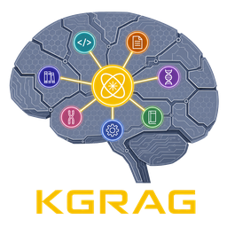
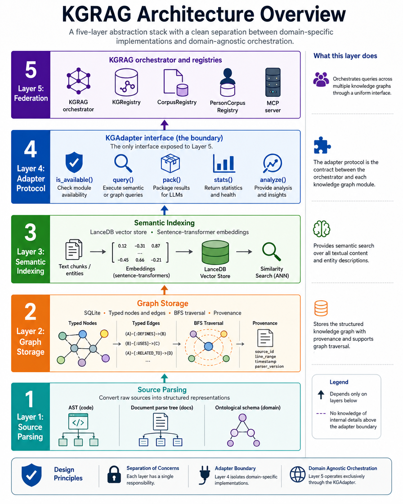

[](https://www.python.org/)
[](https://www.elastic.co/licensing/elastic-license)
[](https://github.com/Flux-Frontiers/KGRAG/releases)
[](https://github.com/Flux-Frontiers/KGRAG/actions/workflows/ci.yml)
[](https://python-poetry.org/)
[](https://doi.org/10.5281/zenodo.20018525)

<p align="center">
  
</p>

**KGRAG** — Knowledge Compiler and Federated Retrieval Layer for Ontologically Grounded Domains

*Author: Eric G. Suchanek, PhD · Flux-Frontiers, Liberty TWP, OH*

---

## Overview

<p align="center">
  
</p>

KGRAG is a **federation and orchestration layer** for structural knowledge graphs derived from heterogeneous source domains. It integrates [PyCodeKG](https://github.com/Flux-Frontiers/pycode_kg) (Python codebase analysis), [DocKG](https://github.com/Flux-Frontiers/doc_kg) (semantic document indexing), [MetaboKG](https://github.com/Flux-Frontiers/metabo_kg) (metabolic pathways), [DiaryKG](https://github.com/Flux-Frontiers/diary_kg) (personal diary corpora), [AgentKG](https://github.com/Flux-Frontiers/agent_kg) (conversational memory), [FTreeKG](https://github.com/Flux-Frontiers/ftree_kg) (file system trees), and a growing family of domain-specific backends under a **single five-method adapter protocol**.

KGRAG treats **derived structure as ground truth** and uses **semantic embeddings strictly as an acceleration layer** for locating entry points into that structure. All graph traversal, ranking, and snippet extraction is deterministic. When KGRAG output is passed to a language model for synthesis, the model receives verified facts with full source provenance — not approximate embeddings.

**How this differs from RAG and KG-RAG:**
RAG embeds text chunks and retrieves by approximate similarity — no structure, no provenance. KG-RAG (GraphRAG, LlamaIndex KG) uses an LLM to extract entities and edges from text: the graph is inferred, inheriting the extractor's hallucinations. KGRAG derives its graphs from **formal source structure** — ASTs for code, parse trees for prose, reaction schemas for biochemistry — with no language model in the pipeline. The graph is correct by construction. Embeddings are disposable; the graph is not. The retrieval layer **cannot** hallucinate.

→ [Technical paper](articles/kgrag.pdf) · [Manifesto](docs/MANIFESTO.md)

---

## KG Types

### Fully Implemented

| Kind | Backend | Description |
|------|---------|-------------|
| `code` | PyCodeKG | Python codebase — AST-extracted modules, classes, functions, call graphs |
| `doc` | DocKG | Document corpus — Markdown/RST/text indexed by topic, section, and entity |
| `meta` | MetaboKG | Metabolic pathways — biochemical reaction networks (KEGG, BioCyc) |
| `diary` | DiaryKG | Personal diary entries — timestamped chunk graphs with temporal edges |
| `agent` | AgentKG | Conversational memory — Turn/Topic/Task/Summary graph (live session) |
| `filetree` | FTreeKG | File system tree — directory/file/module/dependency structure |
| `memory` | MemoryKG | Episodic memory — hybrid semantic + structural graph for conversation/event corpora |
| `gutenberg` | GutenbergKG | Project Gutenberg book corpus — literature indexed by author, genre, and chapter via DocKG-compatible indices |

### Stub Adapters (protocol boundary, backends under development)

| Kind | Backend | Description |
|------|---------|-------------|
| `ia` | IABookKG | Internet Archive book corpus — public-domain books indexed by genre and topic |
| `pdbfile` | — | PDB structure files — 3D atomic coordinates and protein metadata |
| `disulfide` | — | Disulfide bond data — cysteine connectivity in protein structures |
| `verse` | — | Scripture/verse — Book → Chapter → Verse hierarchy and cross-references |
| `person` | — | Personal knowledge — biographical and relational graphs |
| `legal` | — | Legal corpus — statutory codes and regulations *(TBD)* |

### Corpus Abstractions

**Generic Corpus** — A named collection of any KG instances grouped for scoped federated queries. Useful for project-level or thematic groupings (e.g., `"KGRAG_repos"` combining code + doc KGs).

**Person Corpus** — A corpus enriched with personal metadata representing an individual. Aggregates all KGs relevant to a person — diaries, memories, documents, agent sessions, and more — alongside structured personal data (birth year, address, email, contact info).

---

## Features

- **Multi-domain federation** — Query code, docs, metabolic pathways, diary entries, and conversation history simultaneously
- **Five-method adapter protocol** — `is_available`, `query`, `pack`, `stats`, `analyze`; add a new domain by implementing five methods
- **Unified registry** — Persistent SQLite-backed storage of KG locations, metadata, corpora, and person records
- **Corpus abstraction** — Group KGs into named corpora for scoped federated queries
- **Person corpus** — Model individuals with personal metadata and their associated KG collections
- **Hybrid querying** — Semantic seeding via LanceDB + structural BFS traversal
- **Context packing** — Extract source-grounded snippets with line numbers for direct LLM ingestion
- **MCP server** — 22 tools exposing registry, corpus, and person operations to any MCP-compatible agent
- **CLI tooling** — Full CRUD for KGs, corpora, and person corpora; query, pack, analyze, synthesize
- **Streamlit dashboard** — Interactive browser for exploring and querying registered knowledge graphs
- **Deterministic retrieval** — Auditable, source-grounded results; zero hallucination at the knowledge layer

---

## Quick Start

```bash
pip install kg-rag

# With Streamlit dashboard
pip install 'kg-rag[viz]'

# With PyCodeKG / DocKG / FTreeKG adapters
pip install 'kg-rag[kg]'

# With git-sourced adapters (AgentKG, DiaryKG, MetaboKG, MemoryKG) — Poetry only
poetry install --with kgdeps
```

```bash
# Register a Python codebase
kgrag register my-code code /path/to/my-repo

# Federated query across all registered KGs
kgrag query "authentication flow"

# Snippet pack for LLM ingestion
kgrag pack "database connection setup" --out context.md

# Launch the dashboard
kgrag viz
```

→ [Full installation guide](docs/INSTALLATION.md) · [Usage guide](docs/USAGE.md) · [CLI reference](docs/CLI_REFERENCE.md)

---

## MCP Integration

KGRAG ships a built-in MCP server exposing **22 tools** to any MCP-compatible agent (Claude Code, Cursor, GitHub Copilot, Claude Desktop):

```bash
kgrag mcp
```

```json
{
  "mcpServers": {
    "kgrag": {
      "command": "/path/to/venv/bin/kgrag",
      "args": ["mcp"]
    }
  }
}
```

Tools span three groups: **core KG** (`kgrag_stats`, `kgrag_list`, `kgrag_info`, `kgrag_query`, `kgrag_pack`), **corpus** (8 tools), and **person corpus** (9 tools).

→ [Full MCP reference](docs/MCP.md)

---

## Documentation

| Document | Description |
|----------|-------------|
| [Technical Paper](articles/kgrag.pdf) | Architecture, design principles, and formal treatment |
| [Manifesto](docs/MANIFESTO.md) | The case for Structurally-Grounded Synthetic Intelligence |
| [Installation Guide](docs/INSTALLATION.md) | Prerequisites, venv setup, extras |
| [Usage Guide](docs/USAGE.md) | Workflows, patterns, and examples |
| [CLI Reference](docs/CLI_REFERENCE.md) | Complete command reference |
| [MCP Reference](docs/MCP.md) | Tool reference and agent configuration |
| [Adapter Spec](docs/ADAPTER_SPEC.md) | Five-method protocol for new backends |
| [Troubleshooting](docs/TROUBLESHOOTING.md) | Common issues and fixes |

---

## Related Projects

| Project | Description |
|---------|-------------|
| [PyCodeKG](https://github.com/Flux-Frontiers/pycode_kg) | Deterministic knowledge graph for Python codebases |
| [DocKG](https://github.com/Flux-Frontiers/doc_kg) | Semantic knowledge graph for document corpora |
| [MetaboKG](https://github.com/Flux-Frontiers/metabo_kg) | Metabolic pathway knowledge graph |
| [DiaryKG](https://github.com/Flux-Frontiers/diary_kg) | Diary and personal journal corpus knowledge graph |
| [AgentKG](https://github.com/Flux-Frontiers/agent_kg) | Conversational memory knowledge graph |
| [FTreeKG](https://github.com/Flux-Frontiers/ftree_kg) | File system tree knowledge graph |
| [MemoryKG](https://github.com/Flux-Frontiers/memory_kg) | Episodic memory knowledge graph for conversation and event corpora |
| [GutenbergKG](https://github.com/Flux-Frontiers/gutenberg_kg) | Project Gutenberg book corpus knowledge graph |
| [IABookKG](https://github.com/Flux-Frontiers/ia_kg) | Internet Archive book corpus knowledge graph *(under development)* |

---

## License

[Elastic License 2.0](https://www.elastic.co/licensing/elastic-license) — see [LICENSE](LICENSE).

Free to use, modify, and distribute. You may not offer the software as a hosted or managed service to third parties. Commercial internal use is permitted.

If you use KGRAG in research, please cite: [](https://doi.org/10.5281/zenodo.20018525)

*The Knowledge Compiler concept and its execution are the subject of a pending U.S. provisional patent application.*
